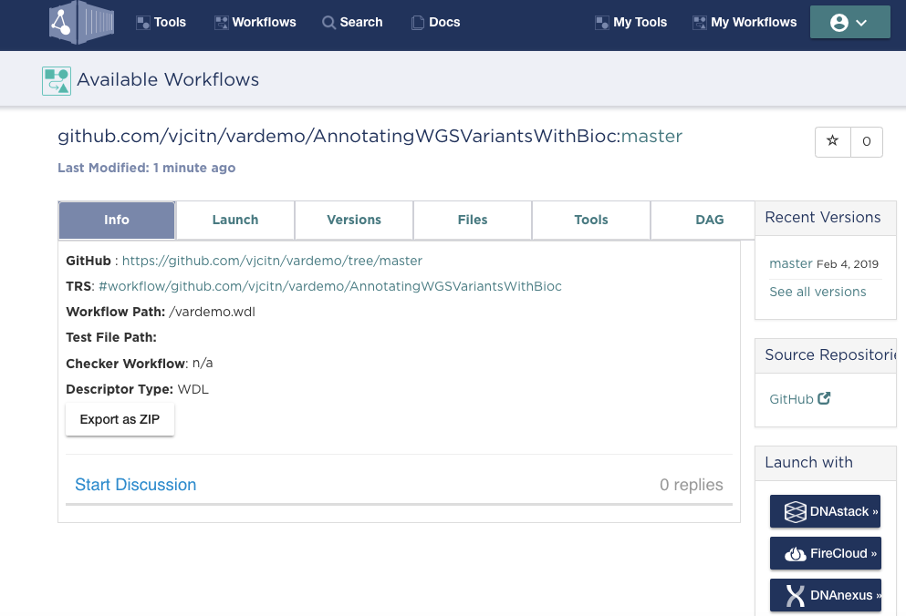

```{r setup}
suppressPackageStartupMessages({
library(bcds)
library(DT)
library(BiocStyle)
})
```

# Introduction: Basic concepts of Dockstore and Bioconductor

Dockstore is the "VM/Docker sharing infrastructure and management component"
of the Global Alliance for Genomics and Health (GA4GH).
Dockstore.org implements the
infrastructure by defining APIs for coupling Docker images
with formalized workflow specifications.
The application
of this concept to the PanCancer Analysis of Whole Genomes
(PCAWG) is described in a 
[2017 paper](https://www.ncbi.nlm.nih.gov/pmc/articles/PMC5333608/) by
O'Connor and colleagues.

[Bioconductor](http://www.bioconductor.org) 
is a software ecosystem based in the R language
for the analysis and comprehension of genome-scale experiments.
[An overview](https://www.ncbi.nlm.nih.gov/pmc/articles/PMC4509590/) 
was published in 2015.

Bioconductor implemented a ["common workflow"](https://www.bioconductor.org/packages/release/BiocViews.html#___Workflow) concept a number
of years ago.  (The term "common" is used on the Bioconductor
landing page, to indicate that many bioinformaticians would
be expected to engage with tasks reviewed in these workflows.
The "common workflow" phrase is not intended to indicate
a relationship to CWL, the "common workflow language" standard.)

In Bioconductor parlance, a "common workflow" is an R package
accompanied by a markdown or Sweave vignette that narrates
and executes the workflow tasks using R.  Any sufficiently
endowed deployment of R on a sufficient computing platform
will run the workflow tasks to completion; this assertion is
checked on a regular basis through Bioconductor's continuous
integration system.  When the assertion fails, the workflow
maintainer is alerted and corrections are made.

Advantages to marrying the Bioconductor workflow concept with
Dockstore VM/Docker/workflow infrastructure include

- reduction in user burden of configuring and maintaining the
execution platform
- utilization of parameterized formal workflow specification in CWL,
WDL, or Nextflow
- general advantages to users of fostering participation in GA4GH
best practices related to reproducibility and transparency

Open questions concern the balance between specification of
workflow steps in R and in the formal workflow language.  Bioconductor
workflows can be written to take advantage of R's capabilities
to drive computations on potentially heterogeneous
clusters with programmable fault tolerance and job control.
The particular advantages of CWL/WDL/Nextflow and
other aspects of the Dockstore ecosystem need to be experienced,
measured, and documented to help developers establish the
appropriate balance between programming R and programming
an exogenous workflow environment.

# Example: Bioconductor's 'variants' workflow

## Working with Complete Genomics calls for NA06985

The 'variants' [workflow document](https://www.bioconductor.org/packages/devel/workflows/html/variants.html) is regularly compiled to HTML.  Its purpose is to illustrate
the various steps required to annotate WGS results as provided
in a public data release by Complete Genomics from 2011.
We will use standard annotation of genomic regions to
describe contexts of variants reported in NA06985.

## WDL for annotating variants in TRPV* genes for NA06985

The 'variants' workflow document narrates the steps and
annotation resources involved.  The minimal R code for
carrying out the steps is a part of the WDL for the
[demonstration Dockstore Workflow on Annotating WGS Variants](https://dockstore.org/workflows/github.com/vjcitn/vardemo/AnnotatingWGSVariantsWithBioc:master?tab=files).  For completeness,
we include the WDL text here:
```
workflow task1 {
  call doVariantWorkflow { }
}

task doVariantWorkflow {
  command {
    R -e "BiocManager::install('variants', version = '3.9', update=TRUE, ask=FALSE); \
		library('variants'); \
		file <- system.file('vcf', 'NA06985_17.vcf.gz', package = 'cgdv17'); \
		genesym <- c('TRPV1', 'TRPV2', 'TRPV3'); \
		geneid <- select(org.Hs.eg.db, keys=genesym, keytype='SYMBOL', \
		         columns='ENTREZID'); \
		txdb <- TxDb.Hsapiens.UCSC.hg19.knownGene; \
		seqlevelsStyle(txdb) = 'NCBI'; \
		txdb <- keepSeqlevels(txdb, '17'); \
		txbygene = transcriptsBy(txdb, 'gene'); \
		gnrng <- unlist(range(txbygene[geneid[['ENTREZID']]]), use.names=FALSE); \
		names(gnrng) <- geneid[['SYMBOL']]; \
		param <- ScanVcfParam(which = gnrng, info = 'DP', geno = c('GT', 'cPd')); \
		vcf <- readVcf(file, 'hg19', param); \
		ans = locateVariants(vcf, txdb, AllVariants()); \
		table(mcols(ans)[['LOCATION']]); \
                write.csv(as.data.frame(ans), 'trpvar.csv');"
  }
  runtime {
    docker: "bioconductor/devel_core2"
    }
}
```

## A searchable table

The workflow culminates in production of a GRanges transformed to 
a data.frame instance transformed
to CSV.  We have serialized the result in the bcbs package.

```{r dodo, echo=FALSE}
datatable(bcds::trpvar1, options=list(lengthMenu=c(3,5,10,50,100)))
```

Using this table we can see that there are 113 variants annotated to promoter
regions according to the methods of the `r Biocpkg("VariantAnnotation")` package.

## A Dockstore benefit

By registering the WDL (managed in github repository vjcitn/vardemo) with Dockstore,
and publishing it, it can be run verbatim in a variety of hosted services.  Look
for the launching buttons at the bottom right.



# Next steps

This document demonstrates the feasibility of transforming a
nontrivial Bioconductor workflow to a running Dockstore workflow.
The R code was manually extracted (and lightly edited) to
get something that actually works.  However it would seem
that this particular approach is not in the spirit of the
Bioconductor workflow agenda, and does not fully capitalize
on benefits of using formal workflow programming.  Here are a 
few ideas for next steps

- `purl2wdl`, a method for transforming R markdown to runnable WDL.
It is taken for granted that WDL is not intended to carry
narrative, but if this is mistaken, we could have `knit2wdl`
which would propagate narrative as WDL comments.
- Generalizing the variant workflow to larger sets of genomic
elements and larger cohorts.  What aspects of scaling up
should be delegated to the workflow executor as opposed to
programming in R?  How should we manage WDL inputs to define
task parameters and resources in ways 
that are natural for Bioconductor users?
- Collecting information on runtimes and costs will be useful.
